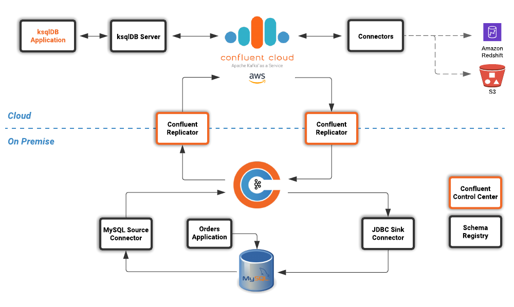

== Introduction

The popularity of hybrid cloud architectures are on the rise as organizations look to unlock siloed, on-premise data sources and take advantage of cloud computing. 

In addition to hybrid cloud architectures, organizations are also looking to become more event driven. The Confluent Platform is a streaming platform that can stream data, in real time, to the systems that need it, when they need it, across an entire organization, whether it's in the data center or the cloud. Processes that were once batch can now become real time, every event can be used to trigger other services and this can all be done using a common API with low latency and high throughput.

In this workshop we will explore how the Confluent Platform and Confluent Cloud running on AWS can enable these architectures by building a real time supply and demand appplication using ksqlDB.

